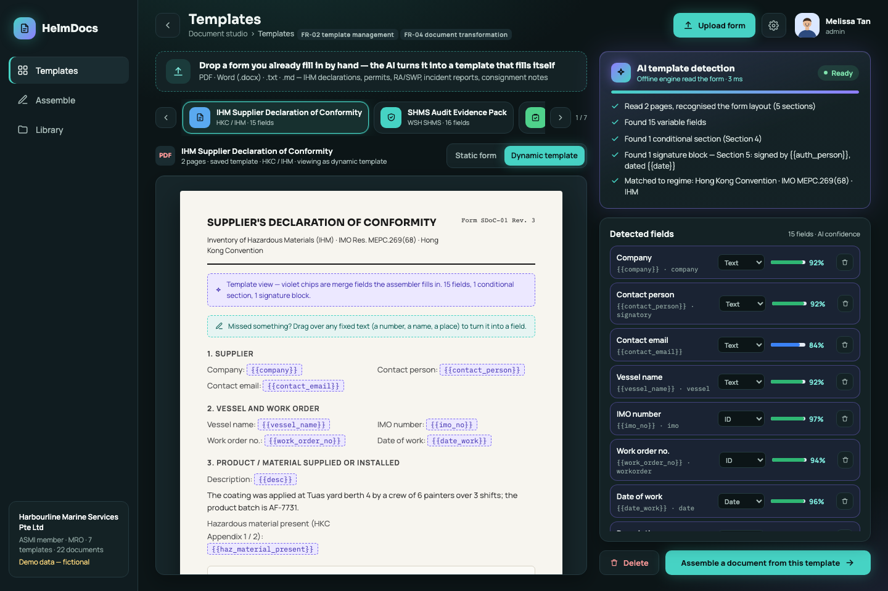
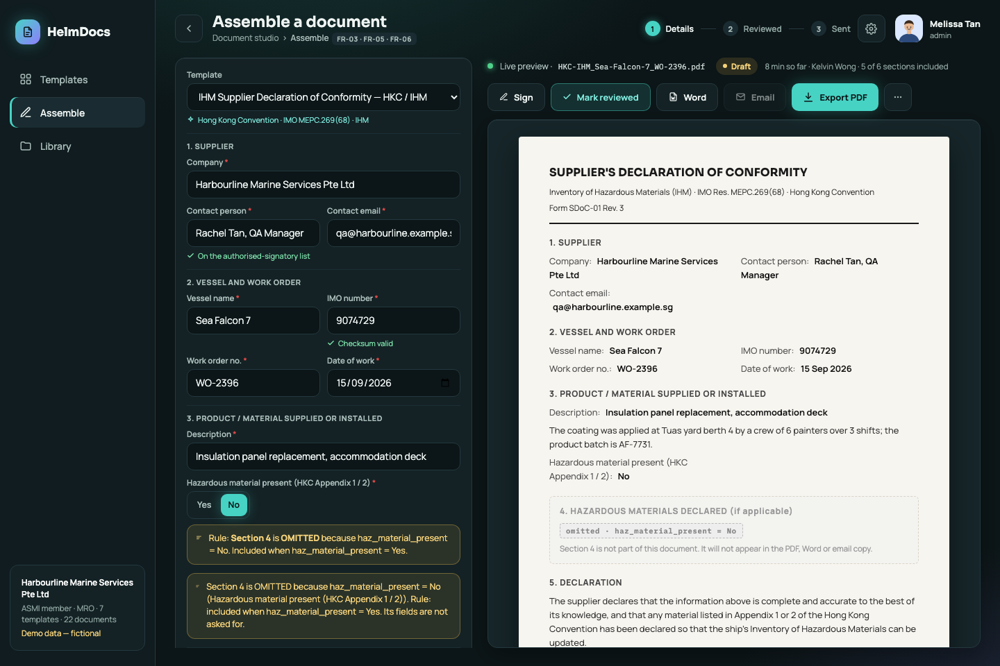
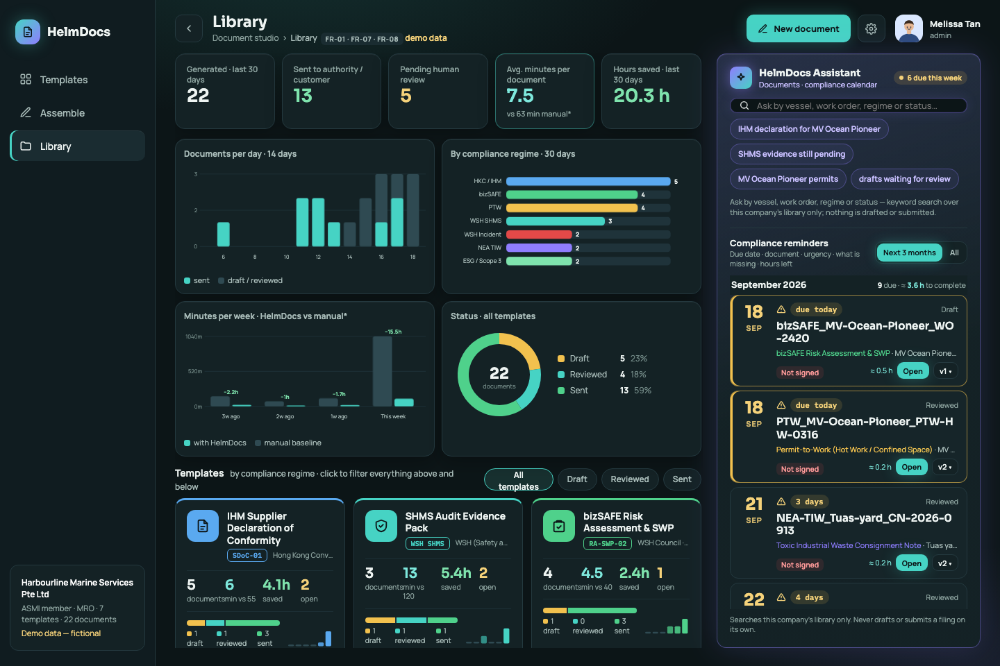
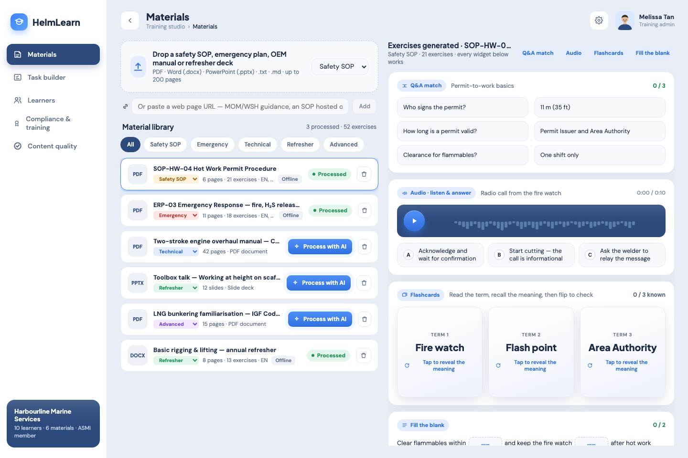
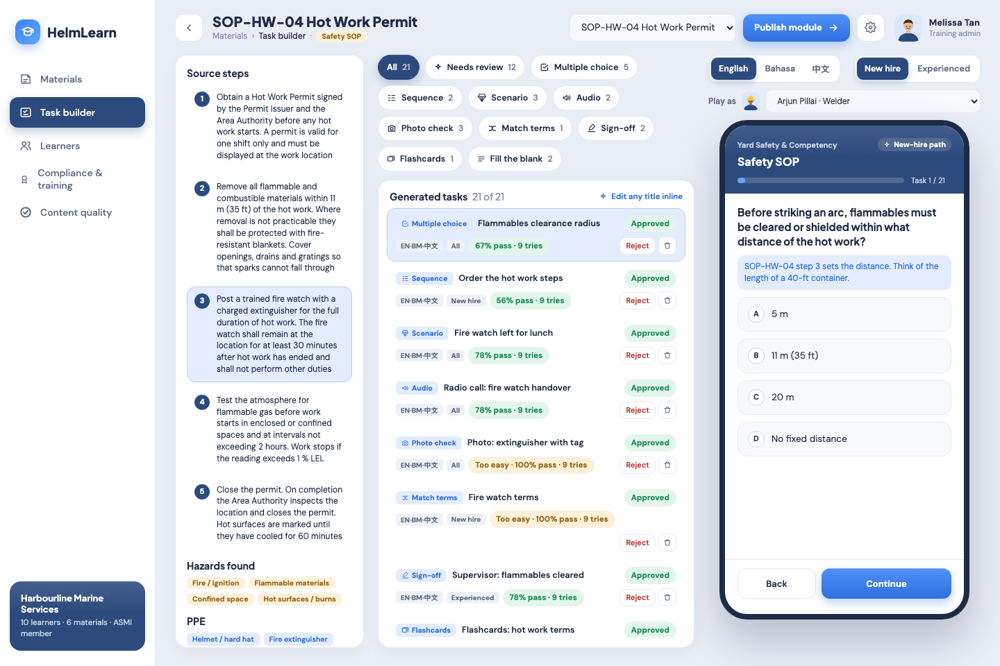
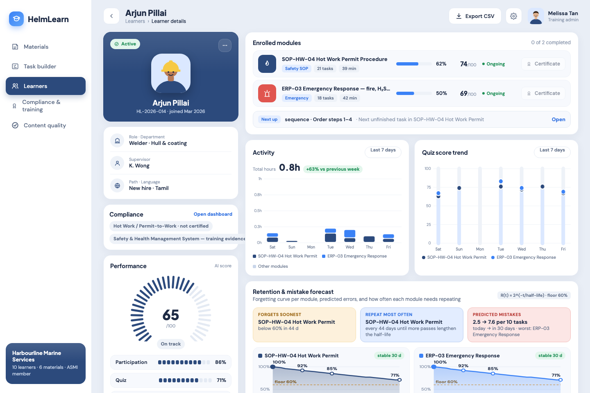
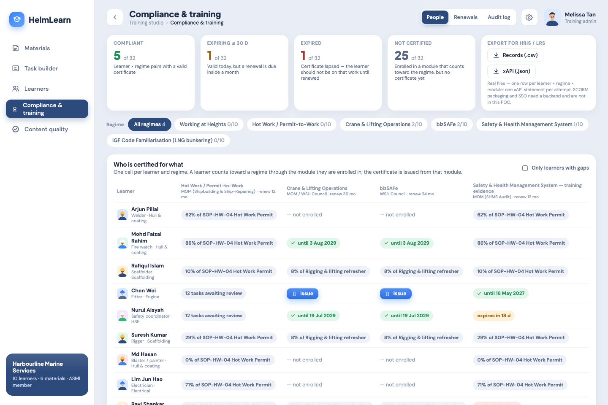
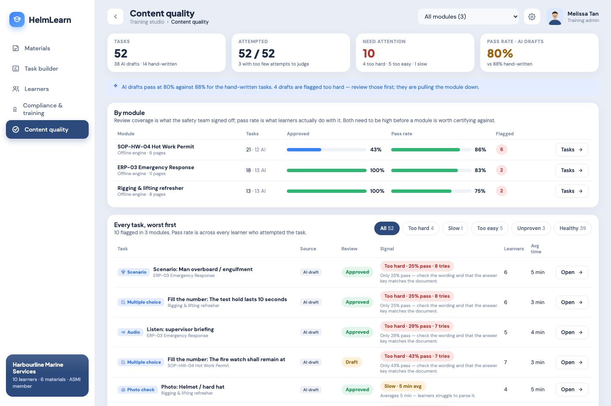

# ASMI GECO — two working POCs for Singapore marine & offshore SMEs

| POC | What it is | IMDA category | Live demo | Code |
|---|---|---|---|---|
| **HelmDocs** | Document assembly for compliance paperwork — a form you fill by hand becomes a template that fills itself | *Document Assembly Software* (Legal) | `http://<vps>/document-assembly/` | [`helmdocs/`](helmdocs/) |
| **HelmLearn** | Gen-AI digital training — a safety SOP or OEM manual becomes playable, tracked training | *Gen-AI Digital Training System* | `http://<vps>/genai-learning/` | [`helmlearn/`](helmlearn/) |

Both run entirely in the browser (no server, no API key needed), with fictional demo data: **Harbourline Marine Services Pte Ltd**,
vessels **MV Ocean Pioneer** and **Sea Falcon 7**, the **Tuas yard**. Every number on screen is computed from live data.

---

## 1. The pain points (from the ASMI member research)

Across the 29 ASMI member companies researched in depth and the 300-member activity check
(see `marine_research/presentation_findings.md`, `compliances.md`, `evidence_base.md`):

| Pain | Evidence | What it looks like on the yard floor |
|---|---|---|
| **Margin pressure / cost base** — the most-cited business problem (7 of 29) | Falling gross margins, rising labour and material cost, legacy low-margin contracts | Every hour of back-office paperwork is an hour not billed |
| **Fragmented / manual systems** (6 of 29) — **no named commercial ERP was verifiable at any member's marine entity** | Goltens' 2025 job postings still cite a legacy **Lotus Approach** database, **handwritten job reports** and Excel; three separate systems after mergers; phone calls between yards | Job cards, supplier PDFs and Excel sheets are the "system of record" |
| **Regulatory burden** (6 of 29) — IHM, SHMS, bizSAFE, WSH, TIW, Scope 3 | **Hong Kong Convention in force since 26 Jun 2025**: every repair job is an IHM update trigger (signed and dated); **SHMS audited every 12 months** (≥200 staff) or reviewed annually; MOM incident report within 10 days; NEA TIW e-Tracking; **Scope 3 questionnaires cascading from SGX-listed customers from FY2026** | The same vessel / work-order / signatory details are re-typed into 5–7 different forms per job |
| **Manpower shortage & multilingual crews** (5 of 29) | Skilled workers scarce; floor crews speak English, Bahasa and Mandarin; time lost to slow manual tasks | Training is a PowerPoint and a signature sheet; nobody knows who is still certified for what |
| **Workforce training / knowledge** (5 of 29) | New fuels, new equipment, new digital tools; certificates that expire | A lapsed Hot-Work certificate is found by the auditor, not by the yard |

**No two members share a software product** — each yard built or bought its own, or has nothing. The gap is at the SME tier
where the workflow is *Excel + paper + WhatsApp chasing*.

## 2. Why this is a payable problem

1. **The paperwork is mandatory and fined.** From 1 June 2024 first-conviction WSH fines run to **S$50,000** for core failures (no risk
   assessment, no SHMS, untrained workers). IHM declarations, SHMS audit evidence, incident reports and TIW consignment notes are not optional
   and each has a legal clock.
2. **Customers gate revenue on it.** SGX-listed principals (Seatrium, ST Engineering-scale customers) push Scope 3 questionnaires and
   IHM material declarations down to their MRO suppliers. No completed form, no purchase order.
3. **It is the cheapest place to recover margin.** Members already cite margin pressure; a document that takes **~55 minutes** to draft by
   hand (IHM SDoC) or **2 hours** (SHMS evidence pack) recurs per job, per quarter. Time saved here needs no new revenue to pay back.
4. **Training has a compliance value, not just a learning value.** Certified-for-what records are what an SHMS auditor asks for first;
   a training system that also keeps the certificate register turns a cost centre into audit evidence.
5. **There is a funded channel.** Both POCs are shaped to the IMDA pre-approved solution requirements (FR-01 … FR-08 mapped in each app's
   README), which is the route to SME co-funding through the association.

## 3. How AI saves the time and the money

| Where | Manual today | With the POC | Demo figure (labelled as demo assumption in the app) |
|---|---|---|---|
| **Turning a form into a template** | Rebuild the form in Word, hunt for every place a vessel name appears | Drop the PDF/DOCX — fields, types, conditional sections and signature blocks are detected; missed ones are added by highlighting text | 15 fields, 1 conditional section, 1 signature block found in < 1 s |
| **Filling the document** | Re-type vessel, IMO, work order, signatory into every form | Fill once; pre-filled from the last work order; live document; conditional sections come and go by rule; Σ totals from attached CSVs | **7.5 min vs 63 min manual** average across the demo library, **20 h saved / month** |
| **Getting it right before it leaves** | The surveyor or auditor finds the error | Pre-submission check: mandatory fields, IMO check digit, authorised signatory, quantity when hazardous = Yes, signature seal | 5 / 5 checks visible on every document |
| **Knowing what is due** | A wall calendar and memory | Compliance reminders: due date from the regime rule, what is still missing, hours left | 3-month calendar, editable rules |
| **Building training from an SOP** | Trainer writes quiz questions by hand, in one language | Drop the SOP — 7 task types (quiz, sequence, scenario, audio, photo check, match, sign-off) drafted from the document's own steps and hazards; multilingual | 21 tasks from a 6-page permit procedure |
| **Knowing who is certified** | Excel sheet, expiry dates missed | Learner × regime matrix, renewals, retention forecast, alerts, CSV / xAPI export for the HRIS | 32 learner-regime pairs tracked, expiries flagged 30 days out |

The "AI" is honest: in both POCs it is a deterministic rule engine running offline (HelmLearn can optionally call DeepSeek), and the UI
reports exactly what the rules found. Nothing is drafted or submitted on the user's behalf.

---

## 4. HelmDocs — Document Assembly (`/document-assembly/`)

### Page 1 · Templates — *the form becomes a template*


1. **Drop a form** (PDF / DOCX / TXT / MD) on the drop zone, or click a saved template card (◀ ▶ or arrow keys switch between them).
   The *AI template detection* card lists what was found: pages, fields, conditional sections, the signature block (who signs, signing date), the regime.
2. **Toggle Static form ↔ Dynamic template.** Same document: the original values, or violet `{{merge_field}}` chips with the *conditional · when haz_material_present = Yes* marker on Section 4.
3. **Fix the fields**, then **Save as template.** Rename inline, change a type (Text / Number / ID / Date / Yes-No / List), delete. Missed something? **Drag over any fixed text** in the document (try *Tuas yard berth 4* or *AF-7731* in the IHM form) and *Add field*.

### Page 2 · Assemble — *fill once, the document writes itself*


1. **Pick a template.** The form is generated from its fields, pre-filled from the last work order; the document on the right rebuilds as you type.
2. **Flip *Hazardous material present* Yes / No** — Section 4 is inserted or removed, and the rule card explains why. Attach a CSV (sample files are one click away) and press **Σ** on a number field to insert a sum / average / count. Watch the **AI pre-submission check** react.
3. **Sign → Mark reviewed → Export.** *Sign* places your drawn / uploaded / typed signature and seals the content with SHA-256 (edit one character afterwards and the seal breaks). *Export PDF*, *Word*, *HTML*, *Print…* are real files; *Email* opens your mail client and marks the document **Sent** — only after a human *Mark reviewed*.

### Page 3 · Library — *dashboards, documents, reminders*


1. **Read the strip and the four charts** (documents per day, by regime, minutes vs manual, status). Click a **template card** or a status chip — everything above and below filters.
2. **Work the document list:** sort, open, change status (Draft → Reviewed → Sent, never skipping review), delete; **Export CSV / XLSX / TSV / XML** of the filtered rows.
3. **Ask the assistant** ("IHM declaration for MV Ocean Pioneer", "SHMS evidence still pending", "WO-2409") and check the **compliance reminders** under it: due date, urgency, what is missing, hours left, *Open* / *Versions*. Rules live in **Settings** (gear), with the authorised-signatory list and *My signatures*.

Details, the engine, the IMDA FR mapping and the test list: [`helmdocs/README.md`](helmdocs/README.md).

---

## 5. HelmLearn — Gen-AI Digital Training (`/genai-learning/`)

### Page 1 · Materials — *drop an SOP, get exercises*


1. **Drop a safety SOP, emergency plan or OEM manual** (PDF / DOCX / PPTX / TXT / MD) and pick a category; click **Process with AI**.
2. **Watch the real stages** (read pages → extract steps, hazards, PPE, numeric facts → draft each task type) — the progress is per stage, not a timer.
3. **Play the preview widgets** on the right (Q&A match, audio briefing, flashcards, fill-the-blank) — every one is live — then *Open all exercises in the task builder*.

### Page 2 · Task builder — *review, edit, publish, play as a learner*


1. **Filter by task type** (multiple choice, sequence, scenario, audio, photo check, match terms, sign-off, flashcards, fill-the-blank), by *Needs review*, by language (English / Bahasa / 中文) and by learner path (New hire / Experienced).
2. **Approve or reject** each draft, edit any title inline, regenerate a type. The phone on the right plays the task exactly as a learner sees it — choose **Play as** a learner to record real attempts.
3. **Publish module** to departments; the Learners page moves immediately.

### Page 3 · Learners — *progress, retention, alerts*


1. **Pick a learner** (or a department filter): progress, quiz average, AI score, weekly hours, quiz trend, the per-module **retention forecast** with the next refresher date.
2. **Read the Learning health & alerts panel:** overdue, due this week, inactive, low quiz, certificate expiring — each with an action.
3. **Export CSV** of the cohort; sort the table by any column.

### Page 4 · Compliance & training — *who is certified for what*


1. **Read the regime strip** (compliant / expiring ≤ 30 d / expired / not certified) and filter by regime (Working at Heights, Hot Work / PTW, Crane & Lifting, bizSAFE, SHMS, IGF Code).
2. **Issue a certificate** from a completed module, or see the renewal date; toggle *Only learners with gaps*; check **Renewals** and the **Audit log**.
3. **Export for HRIS / LRS** — records as CSV, attempts as xAPI JSON.

### Page 5 · Content quality — *is the AI content any good?*


1. **Compare AI drafts to hand-written tasks** — approval coverage and pass rate per module.
2. **Work the flagged list** (too hard, too easy, slow, unproven) worst first.
3. **Open a task** straight into the builder to fix the wording or the answer key.

Details: [`helmlearn/README.md`](helmlearn/README.md).

---

## 6. Run locally

```bash
cd helmdocs && npm install && npm run dev      # http://localhost:5174
cd helmlearn && npm install && npm run dev     # http://localhost:5173
npm test        # Vitest unit tests (engine + stats)
npm run e2e     # Playwright drives the real UI (npm run e2e:install once for Chromium)
npm run build   # type-check + production build
```

## 7. Deploy to the VPS

`deploy/deploy.sh` builds HelmDocs for `/document-assembly/`, uploads it as static files, uploads HelmLearn's source and builds it on
the server (it needs its small server-side URL-import helper, so it runs as a `vite preview` systemd service), installs the nginx site
and the landing page, and checks both URLs:

```bash
HOST=173.208.162.243 USER=administrator ./deploy/deploy.sh      # password prompts, or SSHPASS=… with sshpass
```

Files: `deploy/nginx-asmi-poc.conf` (both sub-paths on port 80), `deploy/helmlearn-preview.service`, `deploy/index.html` (landing page).
Requires Ubuntu/Debian with sudo; installs nginx and Node 22 if missing.

## 8. What is not real in the POCs

Detection and generation are rule engines, not models (HelmLearn's DeepSeek mode is optional). No OCR — scanned PDFs are refused with a
reason. Email is a `mailto:` hand-off. The signature seal is a SHA-256 integrity hash, not a certificate signature. Manual-minutes
baselines and deadline rules are editable demo assumptions. All company, vessel and people names are fictional.
